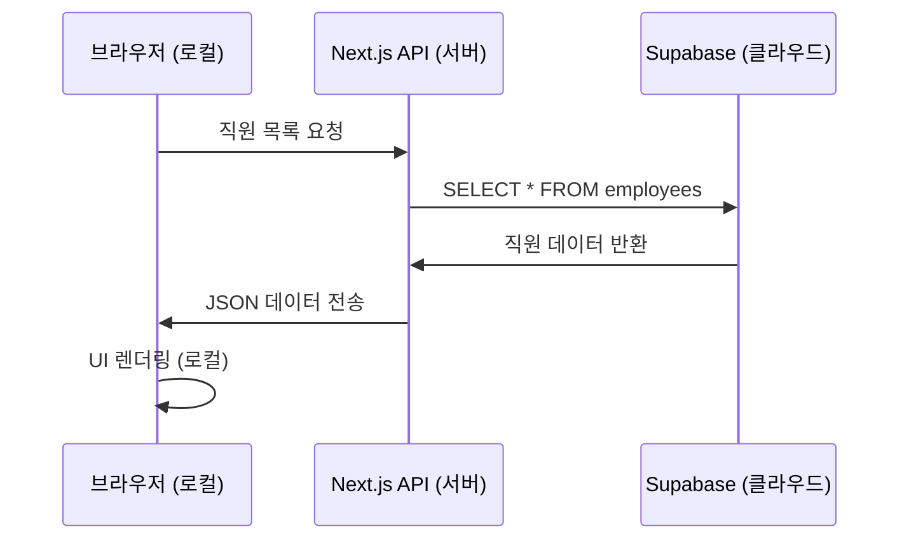
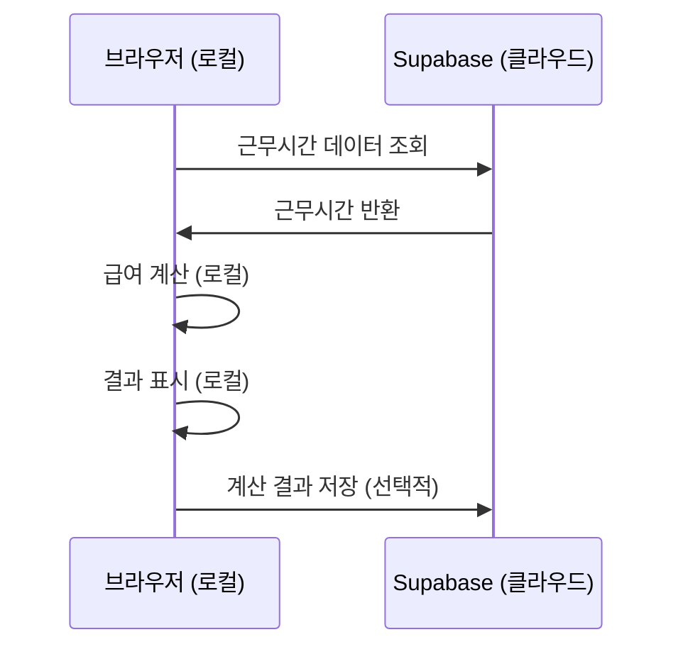

# HR 관리 시스템 - 클라우드 vs 로컬 서비스 구분 가이드

# 결론

DB관련 로직은 클라우드에서 하고, .ts파일 등 계산 로직은 로컬에서 처리함.

## 개요
현재 HR 관리 시스템에서 어떤 부분이 클라우드에서 처리되고, 어떤 부분이 로컬(사용자 컴퓨터)에서 처리되는지 명확히 구분하여 설명합니다.

## 아키텍처 개념

### 클라우드 서비스 (Cloud Services)
- **정의**: 인터넷을 통해 원격 서버에서 제공되는 서비스
- **특징**: 24/7 접근 가능, 확장성, 데이터 영속성, 다중 사용자 지원
- **비용**: 사용량에 따른 과금, 인프라 관리 불필요

### 로컬 서비스 (Local/Client-side Services)
- **정의**: 사용자의 브라우저나 컴퓨터에서 직접 실행되는 서비스
- **특징**: 빠른 응답속도, 오프라인 작업 가능, 개인정보 보호
- **제한**: 브라우저 종료 시 데이터 손실 가능, 기기별 독립적

## 현재 프로젝트 분석

### 🌐 클라우드 서비스 (Supabase)

#### 1. 데이터베이스 서비스
```typescript
// 모든 DB 작업은 클라우드에서 처리
import { createClient } from '@supabase/supabase-js'

const supabase = createClient(
  process.env.NEXT_PUBLIC_SUPABASE_URL!,
  process.env.NEXT_PUBLIC_SUPABASE_ANON_KEY!
)
```

**클라우드에서 처리되는 데이터:**
- 직원 정보 (`employees` 테이블)
- 급여 정보 (`payroll` 테이블)
- 근무 일정 (`schedules` 테이블)
- 사용자 인증 정보 (`auth.users`)
- 스토어 정보 (`stores` 테이블)
- 예외사항 (`schedule_exceptions` 테이블)

#### 2. 인증 서비스
```typescript
// 사용자 로그인/로그아웃은 Supabase Auth에서 처리
const { data, error } = await supabase.auth.signInWithPassword({
  email: 'user@example.com',
  password: 'password'
})
```

#### 3. 실시간 구독 (Real-time)
```typescript
// 데이터 변경사항을 실시간으로 감지
supabase
  .channel('schedule-changes')
  .on('postgres_changes', 
    { event: '*', schema: 'public', table: 'schedules' },
    (payload) => console.log('Change received!', payload)
  )
  .subscribe()
```

#### 4. 파일 저장소 (Storage)
```typescript
// 파일 업로드/다운로드는 Supabase Storage에서 처리
const { data, error } = await supabase.storage
  .from('documents')
  .upload('contracts/contract.pdf', file)
```

### 💻 로컬 서비스 (브라우저/클라이언트)

#### 1. UI 렌더링 및 상태 관리
```typescript
// React 컴포넌트는 브라우저에서 렌더링
const [employees, setEmployees] = useState([])
const [loading, setLoading] = useState(false)
```

#### 2. 클라이언트 사이드 계산
```typescript
// 급여 계산 로직은 브라우저에서 실행
// lib/payroll-calculator-new.ts
export function calculatePayroll(employee: Employee, workHours: number) {
  const hourlyWage = 10030 // 2025년 최저시급
  const grossPay = workHours * hourlyWage
  
  // 4대보험, 세금 계산 등은 모두 클라이언트에서 처리
  const nationalPension = grossPay * 0.045
  const healthInsurance = grossPay * 0.03545
  // ...
  
  return {
    grossPay,
    deductions: { nationalPension, healthInsurance },
    netPay: grossPay - totalDeductions
  }
}
```

#### 3. 폼 검증 및 입력 처리
```typescript
// 사용자 입력 검증은 브라우저에서 즉시 처리
const validateForm = (data: FormData) => {
  if (!data.name) return '이름을 입력해주세요'
  if (!data.email.includes('@')) return '올바른 이메일을 입력해주세요'
  return null
}
```

#### 4. PDF 생성 및 다운로드
```typescript
// PDF 생성은 브라우저에서 처리 (jsPDF 라이브러리)
import jsPDF from 'jspdf'

const generatePDF = (data: ContractData) => {
  const doc = new jsPDF()
  doc.text('근로계약서', 20, 20)
  // PDF 생성 로직은 모두 클라이언트에서 실행
  doc.save('contract.pdf')
}
```

#### 5. 로컬 스토리지 및 세션 관리
```typescript
// 브라우저 로컬 스토리지 사용
localStorage.setItem('user-preferences', JSON.stringify(preferences))
sessionStorage.setItem('temp-data', JSON.stringify(tempData))
```

## 하이브리드 처리 과정

### 1. 데이터 조회 과정


### 2. 급여 계산 과정


## 서비스별 상세 분석

### Next.js 서버 사이드 렌더링 (SSR)
```typescript
// 서버에서 초기 데이터를 미리 렌더링
export async function getServerSideProps() {
  const { data: employees } = await supabase
    .from('employees')
    .select('*')
  
  return {
    props: { employees } // 클라이언트로 전송
  }
}
```
- **처리 위치**: Vercel/Netlify 등 호스팅 서버 (클라우드)
- **목적**: 초기 페이지 로딩 속도 향상, SEO 최적화

### API Routes
```typescript
// app/api/employees/route.ts
export async function GET() {
  const { data, error } = await supabase
    .from('employees')
    .select('*')
  
  return Response.json(data)
}
```
- **처리 위치**: Next.js 서버 (클라우드)
- **목적**: 데이터베이스와 클라이언트 간 중간 계층

## 보안 및 성능 고려사항

### 클라우드 서비스의 장점
1. **데이터 보안**: 전문적인 보안 관리
2. **확장성**: 사용자 증가에 따른 자동 확장
3. **백업**: 자동 데이터 백업 및 복구
4. **접근성**: 어디서나 접근 가능

### 로컬 처리의 장점
1. **성능**: 네트워크 지연 없는 즉시 처리
2. **프라이버시**: 민감한 계산은 로컬에서 처리
3. **오프라인**: 인터넷 연결 없이도 일부 기능 사용 가능
4. **비용**: 서버 리소스 절약

## 실제 사용 시나리오

### 시나리오 1: 직원 정보 조회
1. **브라우저**: 직원 목록 페이지 접속
2. **클라우드**: Supabase에서 직원 데이터 조회
3. **브라우저**: 받은 데이터로 테이블 렌더링
4. **브라우저**: 검색, 필터링 등은 로컬에서 처리

### 시나리오 2: 급여 계산
1. **클라우드**: 근무시간 데이터 조회
2. **브라우저**: 급여 계산 로직 실행
3. **브라우저**: 계산 결과 표시
4. **클라우드**: 최종 결과 데이터베이스 저장

### 시나리오 3: 근로계약서 생성
1. **클라우드**: 직원 정보 조회
2. **브라우저**: 계약서 양식 작성
3. **브라우저**: PDF 생성 및 다운로드
4. **클라우드**: 계약서 정보 데이터베이스 저장 (선택적)

## 개발 시 고려사항

### 1. 데이터 민감도에 따른 처리 위치 결정
```typescript
// 민감한 개인정보는 서버에서만 처리
export async function POST(request: Request) {
  const { ssn } = await request.json()
  
  // 주민번호 같은 민감 정보는 서버에서만 처리
  const maskedSSN = maskSSN(ssn) // 서버에서 마스킹
  
  return Response.json({ maskedSSN })
}
```

### 2. 성능 최적화
```typescript
// 자주 사용되는 데이터는 클라이언트에서 캐싱
const [cachedEmployees, setCachedEmployees] = useState([])

useEffect(() => {
  if (cachedEmployees.length === 0) {
    fetchEmployees() // 최초 1회만 서버에서 조회
  }
}, [])
```

### 3. 오류 처리
```typescript
// 네트워크 오류 시 로컬 캐시 사용
const fetchWithFallback = async () => {
  try {
    const data = await fetchFromServer()
    localStorage.setItem('backup-data', JSON.stringify(data))
    return data
  } catch (error) {
    const backup = localStorage.getItem('backup-data')
    return backup ? JSON.parse(backup) : []
  }
}
```

## 결론

현재 HR 관리 시스템은 **하이브리드 아키텍처**를 사용합니다:

- **클라우드 (Supabase)**: 데이터 저장, 인증, 실시간 동기화
- **로컬 (브라우저)**: UI 렌더링, 계산 로직, 사용자 상호작용

이러한 구조는 **보안성**, **성능**, **사용자 경험**을 모두 고려한 최적의 설계입니다. 중요한 데이터는 안전한 클라우드에 저장하면서도, 사용자 인터페이스와 계산 로직은 빠른 로컬 처리로 반응성을 보장합니다.
