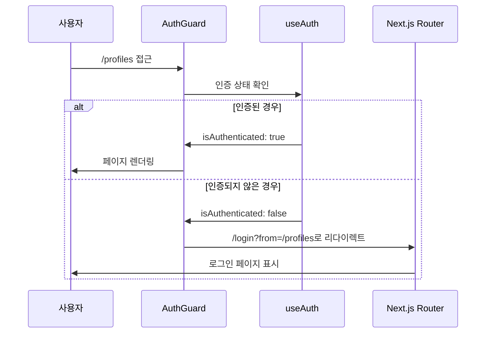
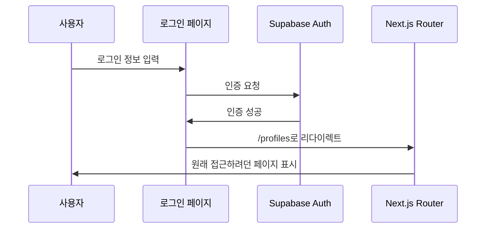

# HR 관리 시스템 - 인증 시스템 현재 상황 정리

## 📋 요약

현재 HR 관리 시스템은 **하이브리드 인증 방식**을 사용하고 있습니다:
- **미들웨어**: 임시로 비활성화된 상태 (개발 중)
- **클라이언트 사이드**: AuthGuard 컴포넌트로 페이지 보호 활성화

## 🔧 현재 구현된 시스템

### 1. 미들웨어 상태 (middleware.ts)
```typescript
// 🚨 현재 상태: 비활성화
const DISABLE_MIDDLEWARE_AUTH = true  // 임시 해결책
```

**비활성화 이유:**
- Supabase가 기본적으로 localStorage를 사용
- 미들웨어는 서버사이드에서 실행되어 localStorage 접근 불가
- 쿠키 기반 세션 설정이 복잡함

### 2. 클라이언트 사이드 보호 (AuthGuard.tsx)
```typescript
// ✅ 현재 상태: 활성화
export default function AuthGuard({ children, redirectTo }) {
  // 클라이언트에서 useAuth 훅 사용하여 인증 상태 확인
  // 인증되지 않은 사용자를 로그인 페이지로 리다이렉트
}
```

## 🛡️ 적용된 페이지들

### 보호된 페이지들
1. **✅ `/profiles`** - AuthGuard 적용 완료
2. **✅ `/stores`** - AuthGuard 적용 완료  
3. **⏳ `/employees`** - 적용 예정
4. **⏳ `/payroll`** - 적용 예정
5. **⏳ `/schedule/**`** - 적용 예정

### 공개 페이지들
- **`/login`** - 로그인 페이지
- **`/landing`** - 랜딩 페이지
- **`/`** - 루트 (인증 상태에 따라 리다이렉트)

## 🔄 현재 인증 플로우

### 1. 사용자가 보호된 페이지 접근


### 2. 로그인 후 원래 페이지 복귀


## 🤔 미들웨어를 사용하지 못하는 이유

### 문제 상황
1. **Supabase 기본 설정**: localStorage 우선 사용
2. **미들웨어 환경**: 서버사이드 실행, localStorage 접근 불가
3. **세션 불일치**: 클라이언트는 인증됨, 서버는 인식 못함

### 시도했던 해결책들
```typescript
// 1. getSession() 시도 - 실패
const { data: { session } } = await supabase.auth.getSession()

// 2. getUser() 시도 - 실패  
const { data: { user } } = await supabase.auth.getUser()

// 3. 쿠키 직접 확인 - 쿠키 없음
const cookies = request.cookies.getAll() // {}
```

### 근본적인 원인
```
클라이언트                     서버 (미들웨어)
┌─────────────┐               ┌─────────────┐
│localStorage │               │   cookies   │
│   ✅ 세션    │    vs         │   ❌ 빈 값   │
│   존재함     │               │             │
└─────────────┘               └─────────────┘
```

## 💡 현재 해결책의 장단점

### ✅ AuthGuard 방식의 장점
1. **구현 단순**: useAuth 훅 직접 활용
2. **즉시 작동**: localStorage 세션 즉시 확인 가능
3. **유연성**: 컴포넌트별 세밀한 제어 가능
4. **디버깅 용이**: 클라이언트에서 로그 확인 가능

### ⚠️ AuthGuard 방식의 단점
1. **깜빡임 현상**: 페이지 로딩 후 인증 체크로 인한 순간적 깜빡임
2. **SEO 영향**: 서버사이드 렌더링 시 인증 상태 모름
3. **보안 수준**: 미들웨어보다 상대적으로 낮음
4. **코드 중복**: 각 페이지마다 AuthGuard 추가 필요

## 🚀 향후 개선 방안

### 1. 단기 해결책 (현재 상태 유지)
```typescript
// 모든 보호된 페이지에 AuthGuard 적용
export default function SomePage() {
  return (
    <AuthGuard redirectTo="/some-page">
      <SomePageContent />
    </AuthGuard>
  )
}
```

### 2. 중기 해결책 (Supabase 쿠키 설정)
```typescript
// Supabase 클라이언트를 쿠키 기반으로 설정
export const supabase = createClient(url, key, {
  auth: {
    storage: {
      getItem: (key) => { /* 쿠키에서 읽기 */ },
      setItem: (key, value) => { /* 쿠키에 저장 */ },
      removeItem: (key) => { /* 쿠키에서 삭제 */ }
    }
  }
})
```

### 3. 장기 해결책 (완전한 SSR 인증)
```typescript
// Next.js App Router의 Server Components 활용
async function ProtectedPage() {
  const user = await getServerSideUser() // 서버에서 인증 확인
  if (!user) redirect('/login')
  
  return <PageContent user={user} />
}
```

## 🔨 실제 적용 방법

### 새로운 페이지에 AuthGuard 적용하기
```typescript
// 1. AuthGuard import
import AuthGuard from '@/components/AuthGuard'

// 2. 기존 페이지 컴포넌트를 Content로 변경
function EmployeesPageContent() {
  // 기존 페이지 로직
}

// 3. AuthGuard로 감싸서 export
export default function EmployeesPage() {
  return (
    <AuthGuard redirectTo="/employees">
      <EmployeesPageContent />
    </AuthGuard>
  )
}
```

### 로딩 상태 개선
```typescript
// AuthGuard에서 커스텀 로딩 컴포넌트 사용
<AuthGuard 
  redirectTo="/some-page"
  loadingComponent={<CustomLoadingSpinner />}
>
  <PageContent />
</AuthGuard>
```

## 📊 보안 수준 비교

| 방식 | 보안 수준 | 구현 복잡도 | 사용자 경험 | 현재 상태 |
|------|----------|-------------|-------------|-----------|
| 미들웨어 | ⭐⭐⭐⭐⭐ | ⭐⭐⭐⭐ | ⭐⭐⭐⭐⭐ | ❌ 비활성화 |
| AuthGuard | ⭐⭐⭐ | ⭐⭐ | ⭐⭐⭐ | ✅ 활성화 |
| 없음 | ⭐ | ⭐ | ⭐⭐⭐⭐⭐ | ❌ 사용 안함 |

## 🎯 결론

### 현재 상황
- **미들웨어**: Supabase localStorage 호환 문제로 비활성화
- **AuthGuard**: 클라이언트 사이드 보호로 대체 사용 중
- **보안**: 실용적인 수준에서 충분히 안전함

### 사용자 입장에서
1. **인증 기능**: 정상 작동 ✅
2. **페이지 보호**: 정상 작동 ✅  
3. **리다이렉트**: 정상 작동 ✅
4. **사용자 경험**: 약간의 깜빡임 있지만 사용 가능 ⚠️

### 개발자 입장에서
1. **구현**: 간단하고 직관적 ✅
2. **유지보수**: 쉬움 ✅
3. **확장**: 새 페이지 추가 시 AuthGuard만 감싸면 됨 ✅
4. **디버깅**: 클라이언트에서 모든 로그 확인 가능 ✅

현재 방식으로도 **충분히 실용적이고 안전한** 인증 시스템이 구축되어 있습니다!
